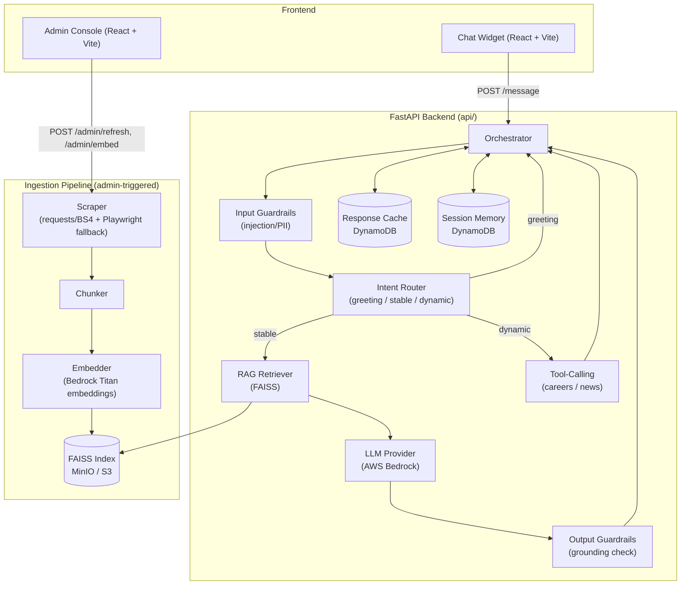

# KKR Chatbot

A cost-optimized, hybrid **RAG + tool-calling** chatbot platform built for KKR.com (originally scaffolded for Ness, and portable to any site via config). It combines FAISS-based semantic search over scraped site content with live tool-calling for frequently-changing data (careers, news), guardrails against prompt injection/PII, response caching, and short-term conversation memory for follow-up questions.

> Swapping to a new website only requires a new `config/sites/<site_id>.json` file and re-running ingestion — no core code changes.

---

## Table of Contents
- [Architecture](#architecture)
- [Tech Stack](#tech-stack)
- [Project Structure](#project-structure)
- [Prerequisites](#prerequisites)
- [Setup](#setup)
- [Running Locally](#running-locally)
- [Content Ingestion (Admin Console)](#content-ingestion-admin-console)
- [How a Message Is Handled](#how-a-message-is-handled)
- [API Reference](#api-reference)
- [Configuration (`config/sites/*.json`)](#configuration-configsitesjson)
- [Session Memory & Caching](#session-memory--caching)
- [Guardrails](#guardrails)
- [Testing](#testing)
- [Docker](#docker)
- [Environment Variables](#environment-variables)
- [Troubleshooting](#troubleshooting)

---

## Architecture



### Request Flow
1. Widget loads → calls `POST /session/start` → gets welcome message + config-driven quick-action buttons (About, Investment Approach, Open Positions, Latest Insights, Contact Us).
2. User sends a message (or clicks a button) → `POST /message` with `site_id`, `message`, and a persistent `session_id`.
3. **Input guardrails** block prompt-injection and PII before any LLM call.
4. **Cache check** — identical queries return instantly (skipped mid-conversation to avoid stale contextual answers).
5. **Intent classification** routes the message:
   - `greeting` → canned welcome reply (no LLM call)
   - `dynamic` (careers/news keywords) → **tool-calling** hits live data, no LLM needed to fetch, LLM only formats
   - `stable` (everything else) → **RAG**: embed query (augmented with the last user turn for follow-ups) → FAISS similarity search → if a confident match is found, generate a grounded answer with Bedrock; otherwise return a safe fallback reply
6. **Output guardrails** verify the LLM answer is actually grounded in the retrieved chunks; ungrounded answers are replaced with a fallback.
7. The turn is cached (first-turn queries only) and appended to **session memory** (last 3 exchanges) so follow-up questions like *"when was it founded?"* can be resolved using prior context.
8. Response (+ a debug **trace** showing handler/intent/RAG scores/LLM model/grounding) is returned to the widget.

---

## Tech Stack

| Layer | Technology |
|---|---|
| Backend API | FastAPI (Python), Uvicorn |
| Orchestration | LangChain (`langchain-aws`) |
| LLM & Embeddings | AWS Bedrock (`amazon.nova-micro-v1:0` for generation, `amazon.titan-embed-text-v1` for embeddings) |
| Vector store | FAISS (cosine similarity via L2-normalized `IndexFlatIP`), persisted to S3/MinIO |
| Cache & session memory | DynamoDB (local via `dynamodb-local`, or real AWS in prod) |
| Object storage | MinIO (local) / S3 (prod) |
| Scraping | `requests` + `BeautifulSoup4`, with Playwright as a headless-browser fallback |
| Chat widget | React 19 + TypeScript + Vite |
| Admin console | React + TypeScript + Vite |
| Testing | pytest |
| Containerization | Docker + docker-compose |

---

## Project Structure

```
Ness Chatbot/
├── api/                      # FastAPI backend
│   ├── app.py                 # Routes: /health, /session/start, /message, /admin/*
│   ├── orchestrator.py        # Core message-handling pipeline
│   ├── intent_router.py       # greeting / stable / dynamic classification
│   ├── rag_retriever.py       # FAISS retrieval + tool-calling registry
│   ├── guardrails.py          # Input (injection/PII) + output (grounding) checks
│   ├── cache.py                # Response cache (DynamoDB)
│   ├── session_memory.py      # Short-term conversation memory (DynamoDB)
│   ├── config_loader.py       # Loads config/sites/<site_id>.json
│   ├── admin_pages.py          # Page candidate CRUD for the admin console
│   ├── llm/                    # LLM provider abstraction (Bedrock, local)
│   └── tools/                  # get_open_positions, get_latest_news, etc.
├── ingestion/
│   ├── scraper.py              # Discovers & scrapes pages (requests/BS4 + Playwright fallback)
│   ├── chunker.py              # Splits page text into overlapping chunks
│   └── embedder.py             # Embeds chunks via Bedrock, builds/uploads FAISS index
├── config/
│   └── sites/
│       ├── kkr.json             # Active site config (branding, quick actions, keywords)
│       └── ness.json
├── widget/                     # End-user chat widget (React + Vite, localhost:5173)
│   └── src/
│       ├── App.tsx              # Chat UI, session/localStorage handling
│       ├── hooks/useChat.ts     # /message API client
│       └── types.ts
├── admin/                      # Content management console (React + Vite, localhost:3000)
│   └── src/AdminConsole.tsx     # Login screen + page selection/refresh/embed UI
├── scripts/
│   ├── create_local_tables.py   # Provisions DynamoDB tables for local dev
│   ├── create_local_bucket.py   # Provisions MinIO bucket for local dev
│   └── create_minio_bucket.py
├── tests/
│   ├── unit/                    # Per-module unit tests
│   └── integration/
├── docker-compose.yml           # dynamodb-local + minio + app
├── Dockerfile
├── requirements.txt
└── architecture.md              # Original design rationale/tradeoffs doc
```

---

## Prerequisites

- Python 3.11+ (tested on 3.14)
- Node.js 18+ and npm
- Docker Desktop (for local DynamoDB + MinIO)
- AWS account with Bedrock access enabled (for the LLM/embeddings), or valid AWS credentials configured locally

---

## Setup

### 1. Clone and install Python dependencies
```powershell
cd "Ness Chatbot"
python -m venv venv
venv\Scripts\activate
pip install -r requirements.txt
playwright install chromium   # only needed if the scraper falls back to headless browsing
```

### 2. Configure environment variables
```powershell
copy .env.example .env
```
Edit `.env` and set at minimum:
- `AWS_ACCESS_KEY_ID` / `AWS_SECRET_ACCESS_KEY` / `AWS_REGION` — must have Bedrock model access
- `ADMIN_API_KEY` — a strong secret for the admin console (see [Environment Variables](#environment-variables))

For **local development** against Docker-based DynamoDB/MinIO instead of real AWS, uncomment in `.env`:
```
AWS_ENDPOINT_URL=http://localhost:9000
DYNAMODB_ENDPOINT_URL=http://localhost:8000
```

### 3. Start local infrastructure (DynamoDB + MinIO)
```powershell
docker-compose up -d dynamodb-local minio
```

### 4. Provision local tables & bucket
```powershell
python scripts/create_local_tables.py
python scripts/create_local_bucket.py
```
This creates the `page_candidates`, `response_cache`, and `session_history` DynamoDB tables, plus the MinIO bucket used to store the FAISS index.

### 5. Install frontend dependencies
```powershell
cd widget; npm install; cd ..
cd admin; npm install; cd ..
```

---

## Running Locally

Run each in its own terminal:

```powershell
# Backend API — http://localhost:8080
python -m uvicorn api.app:app --reload --port 8080

# Chat widget — http://localhost:5173
cd widget; npm run dev

# Admin console — http://localhost:3000 (strictPort: fails loudly if 3000 is taken)
cd admin; npm run dev
```

Verify the backend is up:
```powershell
Invoke-RestMethod http://localhost:8080/health
# -> { "status": "ok" }
```

---

## Content Ingestion (Admin Console)

Ingestion is **manual/admin-triggered** — nothing is scraped or embedded automatically, so no stale or unwanted content silently enters the index.

1. Open the admin console (`http://localhost:3000`) and sign in with `ADMIN_API_KEY`.
2. Click **Refresh Pages** → crawls `sitemap_seeds` from the site config, records discovered URLs into `page_candidates` (status `pending` by default).
3. Review the page list, check the boxes for pages you want in the knowledge base (status → `included`).
4. Click **Embed Selected** → chunks + embeds only `included` pages via Bedrock Titan embeddings, rebuilds the FAISS index, and uploads it to MinIO/S3.
5. Pages under `dynamic_pages` in the site config (careers, news) are **never embedded** — they're always served live via tool-calling so they can't go stale.

---

## How a Message Is Handled

| Intent | Example | Handler | LLM used? |
|---|---|---|---|
| Greeting | "hi", "good morning" | Canned welcome reply | No |
| Dynamic — careers | "any job openings?" | `get_open_positions()` tool | No (LLM not needed; raw structured data returned) |
| Dynamic — news | "what's the latest news?" | `get_latest_news()` tool | No |
| Stable | "what does KKR do?" | FAISS retrieval → Bedrock generation, grounded in retrieved chunks | Yes |
| Quick-action button (canned) | "Contact Us" | Pre-written reply from config, no backend round trip for content | No |
| Blocked | prompt injection / PII | Safe canned reply | No |
| No RAG match | gibberish / off-topic | Configurable fallback reply pointing to contact info | No |

Every response includes a **trace** object (`handler`, `classification`, RAG `scores`/`sources`, `llm_model`, `grounded`, `tool` results, `duration_ms`) surfaced in the widget under each bot reply for debugging/QA — this is a development aid and not meant to ship to end users as-is.

---

## API Reference

Base URL: `http://localhost:8080`

| Method | Path | Auth | Description |
|---|---|---|---|
| GET | `/health` | none | Liveness check |
| POST | `/session/start` | none | `{ site_id }` → welcome message, quick actions, branding |
| POST | `/message` | none | `{ site_id, message, session_id }` → `{ reply, quick_replies, trace, duration_ms }` |
| POST | `/session/clear-cache` | none | `{ session_id? }` → clears response cache (+ that session's conversation memory if `session_id` given) |
| GET | `/admin/pages` | `X-Admin-Key` | `?site_id=` → list of discovered pages and their status |
| PUT | `/admin/pages/{url}` | `X-Admin-Key` | `?site_id=` + `{ url, status }` → update a page's include/exclude status |
| POST | `/admin/refresh` | `X-Admin-Key` | `?site_id=` → run the scraper, populate `page_candidates` |
| POST | `/admin/embed` | `X-Admin-Key` | `?site_id=` → chunk + embed all `included` pages, rebuild FAISS index |

---

## Configuration (`config/sites/*.json`)

Each site is fully described by one JSON file — no code changes needed to onboard a new site:

```jsonc
{
  "site_id": "kkr",
  "base_url": "https://www.kkr.com",
  "sitemap_seeds": ["/", "/about", "/careers", "/insights", "..."],
  "dynamic_pages": {
    "careers": { "url": "/careers", "trigger_keywords": ["career", "job", "hiring", "..."] },
    "news":    { "url": "/insights", "trigger_keywords": ["latest news", "press release", "..."] }
  },
  "greeting_keywords": ["hi", "hello", "good morning", "..."],
  "branding": { "name": "KKR", "primary_color": "#003366", "logo_url": "..." },
  "welcome_message": "👋 Welcome to KKR! ...",
  "quick_actions": [
    { "id": "about", "label": "About KKR", "route": "rag", "query": "What is KKR and what does the company do?" },
    { "id": "careers", "label": "Open Positions", "route": "tool", "tool": "get_open_positions" },
    { "id": "contact", "label": "Contact Us", "route": "canned", "reply": "For inquiries, visit ..." }
  ],
  "fallback_reply": "I couldn't find specific information about that. ..."
}
```

`quick_actions[].route` determines how the widget handles a button click:
- `rag` → sends `query` to `/message` (goes through full RAG pipeline)
- `tool` → sends a phrase that triggers the matching dynamic-page keyword (routes straight to the tool)
- `canned` → renders `reply` directly in the widget, **no backend call**

---

## Session Memory & Caching

- **Response cache** (`response_cache` table): keyed by normalized query hash, 24h TTL. Skipped for messages sent mid-conversation (when session history exists) so a contextual follow-up never returns another session's stale cached answer.
- **Session memory** (`session_history` table): keyed by a client-generated `session_id` (persisted in the widget's `localStorage`), stores the last 3 user/bot exchanges with a 4-hour TTL. Used to:
  - augment RAG retrieval with the previous user turn (helps recall for pronoun-based follow-ups, e.g. "when was **it** founded?")
  - include recent conversation turns in the LLM prompt for context
- The widget also persists the full visible conversation to `localStorage`, so refreshing the page does not lose the chat.
- The 🗑️ button in the widget calls `/session/clear-cache`, wiping both the response cache and that session's conversation memory — useful for testing/demo resets.

---

## Guardrails

- **Input**: regex-based detection of prompt-injection phrases ("ignore previous instructions", "you are now", etc.) and PII (email/phone/card-like patterns) — rejected before any LLM call, with a safe canned reply.
- **Output (grounding check)**: the generated answer is checked for keyword overlap with the retrieved source chunks; if it doesn't appear grounded, it's replaced with a fallback reply instead of risking a hallucinated answer.
- **Confidence threshold**: RAG retrieval only proceeds to LLM generation if the top FAISS similarity score clears `min_score` (currently `0.5`) — below that, a fallback reply is returned with **zero LLM cost**.

---

## Testing

```powershell
python -m pytest tests/ -q -s
```
(`-s` avoids a known capture-stream issue with very new Python builds; safe to omit on standard Python versions.)

Covers: config loading, chunking, guardrails, intent routing, LLM provider abstraction, RAG retriever, cache, admin page management, and the scraper.

---

## Docker

Build and run the full stack (backend + local DynamoDB + MinIO) in containers:
```powershell
docker-compose up -d
```
The same Docker image is designed to be portable to a company on-prem server later — swap `LLM_PROVIDER=local` and point at an internal model endpoint with no code changes elsewhere (see `architecture.md` for the full rationale).

---

## Environment Variables

| Variable | Purpose | Local dev default |
|---|---|---|
| `AWS_ACCESS_KEY_ID` / `AWS_SECRET_ACCESS_KEY` / `AWS_REGION` | AWS credentials for Bedrock (and DynamoDB/S3 in prod) | your real keys |
| `LLM_PROVIDER` | `bedrock` or `local` | `bedrock` |
| `BEDROCK_MODEL_ID` | Generation model | `amazon.nova-micro-v1:0` |
| `BEDROCK_EMBEDDINGS_MODEL_ID` | Embedding model | `amazon.titan-embed-text-v1` |
| `AWS_ENDPOINT_URL` | Override for local MinIO instead of real S3 | `http://localhost:9000` |
| `DYNAMODB_ENDPOINT_URL` | Override for local DynamoDB instead of real AWS | `http://localhost:8000` |
| `DYNAMODB_TABLE_CANDIDATES` | Table name for discovered pages | `page_candidates` |
| `DYNAMODB_TABLE_CACHE` | Table name for response cache | `response_cache` |
| `DYNAMODB_TABLE_SESSIONS` | Table name for session/conversation memory | `session_history` |
| `S3_BUCKET_INDEX` | Bucket for the FAISS index | `ness-chatbot-index-prod` |
| `ADMIN_API_KEY` | Required `X-Admin-Key` header value for `/admin/*` routes | set a strong secret; never expose the real value in UI |
| `SERVER_PORT` / `SERVER_HOST` | FastAPI bind address | `8080` / `0.0.0.0` |
| `LANGSMITH_API_KEY` / `LANGSMITH_PROJECT` | Optional LangChain tracing | blank (disabled) |

⚠️ Never commit real credentials. `.env` is gitignored; use `.env.example` as the template.

---

## Troubleshooting

| Symptom | Likely cause / fix |
|---|---|
| `/message` returns generic fallback for everything | FAISS index not built yet — run ingestion via the admin console, or `min_score` threshold too high for your corpus |
| Admin login fails with 401 | Wrong `X-Admin-Key` — check `ADMIN_API_KEY` in `.env` matches what you're typing |
| Widget shows stale answers after a config change | Click the 🗑️ clear-cache button, or `POST /session/clear-cache` |
| `docker-compose up` DynamoDB container crash-loops on Windows | Already handled via `-inMemory` flag in `docker-compose.yml` (avoids a Docker Desktop volume permission issue) |
| Scraper returns empty content | Site may be JS-rendered; the scraper falls back to Playwright automatically — ensure `playwright install chromium` has been run |
| Admin/widget dev server picks a random port | Both `vite.config.ts` files set `strictPort: true` — free the configured port (5173 / 3000) instead of letting Vite silently switch |
