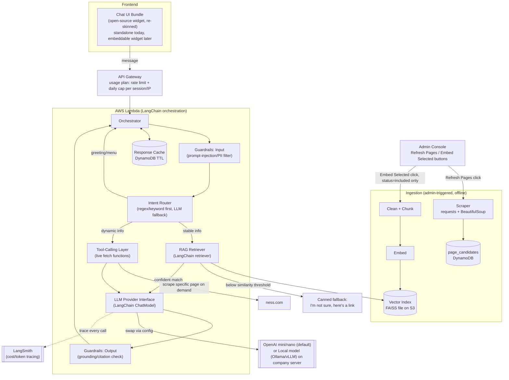

# Ness Chatbot — Architecture

## 0. Answering your Q5: "Is RAG better?"
Yes — for Ness specifically, **hybrid** is correct, not pure RAG:
- **RAG** (embedded/indexed content) for stable info: services, about, industries, leadership, blog, case studies. Cheap (one-time embed + admin-triggered refresh, see §5c), fast, no live scrape per request.
- **Live tool-calling** only for content that changes often or must be exact: open job listings, latest news/press releases, contact form status, pricing (if any). Calling live guarantees no stale/hallucinated data for these.
- Pure RAG risks stale "latest news"/"open roles". Pure live-scraping-on-every-query is slow and burns cost on stable content. Hybrid = cheapest + most accurate.

## 1. Design Principles
1. **Modular by site config** — swapping to a new website = new `site.config.json` + re-run ingestion. Zero core code changes.
2. **Cost-first** — canned replies for greetings (no LLM call), cheapest model tier by default, cache repeated Q&A, serverless (pay-per-invoke), no always-on vector DB subscription.
3. **LLM-provider agnostic** — one interface, swappable via env var. Start on cheapest hosted model, can later point to a self-hosted model on company infra with no code change elsewhere.
4. **Widget-first frontend** — one chat UI bundle, run standalone today, drop-in floating-widget script tag later — same code.

---

## 2. High-Level Diagram


---

## 3. Request Flow
1. **User opens chat** → UI calls `/session/start` → returns canned welcome message + config-driven quick-select buttons (5 options, e.g. *Our Services*, *Careers*, *Contact Us*, *About Ness*, *Talk to Sales*). **No LLM call.**
2. **User clicks a button** → button carries a pre-bound `action_id` from config (see §4) → orchestrator skips the Intent Router entirely and goes straight to the mapped route (canned reply, RAG query, or tool call) → **guaranteed answer, cheapest possible path.**
3. **User types free text instead** → request first passes the **input guardrail** (regex check for prompt-injection/PII, §5a) → rejected/flagged messages get a canned safe reply, no LLM call. Otherwise the Intent Router tries cheap heuristics (greeting/small-talk word list) before touching an LLM.
4. If matched to **stable topic** → RAG: embed query → top-k similarity search in FAISS index. If the best match's similarity score is **below a confidence threshold**, skip the LLM entirely and return the canned fallback ("I'm not sure — here's a relevant link: ...") — cheapest and safest path, avoiding a paid LLM call on a weak/no match. Otherwise, build grounded prompt → LLM generates natural-language answer with citations to source page.
5. If matched to **dynamic topic** (careers/news) → Tool-Calling layer invokes a specific fetch function (e.g. `get_open_positions()`), gets fresh structured data → LLM formats it conversationally.
6. LLM output passes the **output guardrail** (§5a) — checks the answer is grounded in the retrieved/tool context; ungrounded answers are replaced with a safe fallback ("I'm not sure, here's a link").
7. Response cached (query hash → answer, TTL e.g. 24h) in DynamoDB to skip LLM entirely on repeat questions.
8. Every response (button-triggered or free-text) ends with a fresh set of contextual quick-replies (e.g. "Anything else?" → *Careers*, *Contact Us*, *Start Over*) so the user can keep clicking instead of typing.

---

## 4. Modularity: Site Config (the "swap to any website" lever)
```
/config/sites/ness.json
{
  "site_id": "ness",
  "base_url": "https://www.ness.com",
  "sitemap_seeds": ["/", "/about", "/services", "/industries", "/leadership", "/blog", "/case-studies"],
  "dynamic_pages": {
    "careers": { "url": "/careers", "selector": ".job-listing", "trigger_keywords": ["career", "careers", "job", "jobs", "hiring", "vacancy", "open position", "apply"] },
    "news": { "url": "/insights", "selector": ".article-card", "trigger_keywords": ["latest news", "press release", "announcement", "recent blog", "new article"] }
  },
  "greeting_keywords": ["hi", "hello", "hey", "good morning", "good afternoon"],
  "branding": { "name": "Ness", "primary_color": "#...", "logo_url": "..." },
  "welcome_message": "👋 Welcome to Ness! How can I help you today?",
  "quick_actions": [
    { "label": "Our Services", "route": "rag", "query": "What services does Ness offer?" },
    { "label": "Careers", "route": "tool", "tool": "get_open_positions" },
    { "label": "Contact Us", "route": "canned", "reply": "You can reach us at ...", "quick_replies": ["Our Services", "About Ness"] },
    { "label": "About Ness", "route": "rag", "query": "Tell me about Ness as a company" },
    { "label": "Talk to Sales", "route": "canned", "reply": "Sure! Please share your email and a rep will contact you." }
  ]
}
```
Each `quick_action` is a direct route (`canned` / `rag` / `tool`) bound to a button — no free-text typing or intent classification needed for the common 80% of questions. Adding a new client site = add a new file here + run the ingestion job with that `site_id`. Orchestrator, RAG, tools, UI all read from this config — no hardcoded Ness logic in core code paths (only the config *values* are Ness-specific).

**Dynamic pages are never embedded**: `sitemap_seeds` intentionally excludes any URL listed under `dynamic_pages` (careers, insights) — those are served exclusively via live tool-calling. As a safety net (in case a future edit re-adds an overlapping URL), the ingestion job should also filter defensively:
```python
dynamic_urls = {page["url"] for page in config["dynamic_pages"].values()}
pages_to_embed = [url for url in sitemap_seeds if url not in dynamic_urls]
```

---

## 5. LLM Provider Abstraction (cost-swap + local-hosting escape hatch)
```
ILLMProvider {
  generate(prompt, tools?) -> text
  embed(text[]) -> vector[]
}
```
- `OpenAIProvider` (default): `gpt-4o-mini`/`gpt-4.1-nano` for generation, `text-embedding-3-small` for embeddings — cheapest viable hosted tier.
- `LocalProvider`: same interface, calls an internal endpoint (Ollama/vLLM on company server) — enabled by one env var (`LLM_PROVIDER=local`) when you want to move off pay-per-token later.
- Built on **LangChain** (`ChatModel`/`Embeddings` interfaces already provide this provider-swap abstraction, plus retriever + tool-calling primitives, so we don't hand-roll RAG/tool plumbing).
- **How stable vs dynamic is decided** (Intent Router, config-driven, mostly free):
  1. Check message against `greeting_keywords` → if matched, canned welcome/menu reply. No LLM call.
  2. Check message against each `dynamic_pages[*].trigger_keywords` (simple substring/keyword match) → if matched, route to that tool (e.g. "any openings in Pune?" hits `career`/`job` keywords → `get_open_positions`). No LLM call.
  3. **No dynamic keyword matched → default to stable/RAG.** Since Ness only has two dynamic categories (careers, news) with fairly distinct vocabulary, this default covers the vast majority of queries correctly at zero extra cost.
  4. Only if the message is genuinely ambiguous (rare — e.g. config flags overlapping keywords) does a single cheap LLM call classify it into `{greeting, stable, dynamic:<category>}` before proceeding — this is a classification-only call, not a full generation, so it's a few tokens.
- Classification step (greeting vs stable vs dynamic) uses regex/keyword rules first; only ambiguous cases fall back to a cheap LLM call.

---

## 5a. Guardrails (least-cost)
- **Pre-retrieval confidence check** (`RAG` → `FALLBACK` in diagram, runs before any LLM call): if the top FAISS similarity score is below a configurable threshold, skip the LLM entirely and return a canned "I'm not sure, here's a link" reply — cheapest guardrail (zero tokens spent) and the most effective anti-hallucination measure, since a weak retrieval match is the main cause of the LLM guessing.
- **Input** (`GUARDIN` in diagram, runs before intent classification): regex/keyword filter for prompt-injection patterns ("ignore previous instructions", etc.) and PII (email/phone/card patterns) — pure code, no extra API call/cost.
- **Output** (`GUARDOUT` in diagram, runs after the LLM responds, before caching/returning to the user): restrict LLM answers to only use retrieved/tool context (grounding instruction in system prompt) + reject/flag answers with no supporting source chunk, instead of a paid moderation API.
- **Scope control**: system prompt restricts the assistant to Ness-related topics only; off-topic requests get a canned redirect reply (no LLM cost).
- Implemented as thin pre/post-processing steps around the LLM call (LangChain `RunnableLambda`s), not a separate paid guardrail service — keeps cost near zero at this scale.

---

## 5b. Containerization (Docker)
Yes — and it's the correct packaging choice here, not just an option:
- **Why required**: LangChain + FAISS + numpy + BeautifulSoup exceed the 250MB unzipped size limit for standard zip-based Lambda deployments. **Lambda container images** (pushed to ECR, up to 10GB) are the supported way to run this dependency set on Lambda.
- **One image, two entrypoints**: the same image builds both the API handler (`api/orchestrator.py`) and the ingestion handler (`ingestion/scraper.py`) — Lambda lets each function override the image `CMD`, so we don't maintain two separate images.
- **Portability payoff**: this same image is also what makes the "move to a company local server later" requirement trivial — `docker run` the identical image on a VM/ECS/on-prem Kubernetes with no code change, only `LLM_PROVIDER=local` and removing the Lambda runtime interface client wrapper. Local dev also uses this image (`docker compose up`) so dev/prod parity is guaranteed.
- **CI/CD**: GitHub Actions builds the image on push to main, pushes to ECR, then `terraform apply` (or `aws lambda update-function-code`) points the Lambda function at the new image tag.

---

## 5c. Admin Console (manual page selection + on-demand ingestion)
Instead of a scheduled cron and blind embedding, ingestion is fully **admin-triggered** via two buttons in the admin console — no EventBridge, no idle scheduling cost, you decide exactly when a scrape or embed runs:
1. **"Refresh Pages" button** → calls `POST /admin/refresh` → invokes `scraper.py` (discover phase): crawls `sitemap_seeds`, records each found page (`url`, `title`, `last_scraped`, `status`) into a DynamoDB table `page_candidates` — no chunking/embedding yet. New pages default to `status: pending` (excluded); pages already `included` get their `last_scraped` content refreshed in place.
2. **Review & select** (human-in-the-loop): the admin page lists all `page_candidates` for the site with a checkbox per page. You check the ones you want embedded → `PUT /admin/pages/{id}` flips `status` to `included` (or `excluded`).
3. **"Embed Selected" button** → calls `POST /admin/embed` → invokes `chunker.py` + `embedder.py` only on pages where `status = included`, rebuilding the FAISS index. Anything left `pending`/`excluded` is skipped — same guarantee as the `dynamic_pages` exclusion in §4, but now covers *any* page, not just the known careers/news ones.

Why this is worth the added surface area given the cost-first goal:
- **Safety by default**: newly discovered pages never get embedded automatically — nothing enters the FAISS index without your explicit click, so no accidental staleness or off-topic content sneaks into RAG.
- **No idle scheduling cost**: removing EventBridge means zero cost/complexity for a cron that would otherwise run whether or not content actually changed. Trade-off: nothing reminds you to click "Refresh" periodically — staleness now depends on you remembering, acceptable at Ness's low change-frequency scale.
- **Cheap to host**: the admin page is a static bundle on S3 + CloudFront (or skip CloudFront and serve from the same API Gateway/Lambda as a simple HTML route); it reuses the existing Lambda/API Gateway/DynamoDB infra — no new servers, just a few extra routes (`POST /admin/refresh`, `POST /admin/embed`, `GET/PUT /admin/pages`) and one small table.
- **Auth kept minimal**: a single-user Cognito pool (or even a shared admin API key behind a Lambda authorizer) is enough — this isn't a multi-tenant admin system, just a gate for you.
- **Modular**: `page_candidates` is keyed by `site_id`, so the same admin page works for any future client site with zero code changes — just a different `site_id` filter.

---

## 6. Cost Optimization Checklist
| Lever | Approach |
|---|---|
| Greetings/menu | Fully hardcoded, zero LLM/embedding cost |
| Vector store | FAISS index file in S3, loaded into Lambda memory on cold start — no always-on DB bill (fits <1k conversations/month easily) |
| Refresh cadence | Admin-triggered ("Refresh Pages"/"Embed Selected" buttons), not real-time or auto-scheduled |
| Repeat questions | DynamoDB response cache keyed by normalized-query hash + TTL |
| Model tier | Smallest/cheapest hosted model by default; upgradeable per-query only if needed |
| Compute | AWS Lambda (container image, pay-per-invoke) + API Gateway, no idle server |
| Dynamic data | Only scraped live for the few pages that truly change often (careers/news) |
| Abuse protection | API Gateway throttling + per-session daily message cap — stops bots from driving up LLM bills |
| Guardrails | Rule-based (regex/prompt) not paid moderation API — see §5a |
| Packaging | Single Docker image (container Lambda) shared by API + ingestion — one build/registry instead of two, small ECR storage cost only |
| Page selection | Admin approves pages once via a static admin page + existing Lambda/DynamoDB — avoids embedding (and paying for) pages nobody wants — see §5c |

---

## 6a. Tool Stack (finalized)
| Layer | Tool | Why |
|---|---|---|
| Scraper | `requests` + `BeautifulSoup` | ness.com confirmed server-rendered (Next.js SSR) — verified full text present in raw HTML, no headless browser/Playwright compute cost needed |
| Orchestration / RAG / tool-calling | **LangChain** | Off-the-shelf retriever, provider abstraction, and tool-calling agent primitives — less custom code to maintain |
| Vector store | FAISS (via LangChain `FAISS` wrapper), index file in S3 | Free, in-memory, fits small Ness corpus |
| LLM observability & cost tracking | **LangSmith** | Per-trace token/cost visibility, already integrates with LangChain calls |
| Cache | DynamoDB (query-hash → answer, TTL) | Serverless, pay-per-use, avoids repeat LLM calls |
| Infra-as-Code | **Terraform** | Deploys Lambda (container image), ECR, API Gateway, DynamoDB, S3 |
| Compute | AWS Lambda (container image, package_type=Image) + API Gateway | Pay-per-invoke, matches low-traffic scale, supports the larger LangChain/FAISS dependency footprint |
| Packaging | **Docker** (single image, ECR) | Required due to dependency size; same image is portable to a company on-prem server later — see §5b |
| CI/CD | GitHub Actions | Build + push image to ECR, then deploy |
| Frontend widget | Existing open-source chat widget library (re-skinned to Ness branding) | Faster to ship than fully custom UI |
| Abuse control | API Gateway usage plan (rate limit + daily cap per session/IP) | Cheapest guardrail against cost runaway |
| Admin console | Static page (S3/CloudFront) + single-user Cognito auth + existing Lambda/DynamoDB | Gates which pages get embedded — no new servers, minimal auth surface — see §5c |

---

## 7. Folder Structure
```
ness-chatbot/
├── config/
│   └── sites/ness.json
├── ingestion/              # offline batch job (Lambda, admin-triggered via API, image CMD override)
│   ├── scraper.py          # discover phase: writes page_candidates, no embedding
│   ├── chunker.py
│   └── embedder.py         # only processes pages with status=included
├── api/                    # Lambda handler (image CMD override)
│   ├── orchestrator.py
│   ├── intent_router.py
│   ├── rag_retriever.py
│   ├── guardrails.py
│   ├── admin_pages.py      # GET/PUT page_candidates routes for the admin console
│   ├── tools/
│   │   ├── get_open_positions.py
│   │   └── get_latest_news.py
│   ├── llm/
│   │   ├── base_provider.py
│   │   ├── openai_provider.py
│   │   └── local_provider.py
│   └── cache.py
├── widget/                 # single chat UI bundle
│   ├── src/ChatWidget.tsx
│   ├── standalone.html     # mounts widget full-page today
│   └── embed.js            # <script> snippet to float it on any site later
├── admin/                  # static admin console (page selection for embedding, §5c)
│   └── src/PageSelector.tsx
├── Dockerfile              # single image, shared by api/ and ingestion/ (different CMD per Lambda)
├── docker-compose.yml      # local dev + future on-prem run
└── infra/                 # Terraform for Lambda (image), ECR, API GW, S3, DynamoDB, usage-plan throttling
```

---

## 8. UI/UX Notes
- First load: animated welcome bubble + 3–4 quick-select chips (config-driven) so most first-time users never type at all.
- Chat bubble styling, brand color/logo pulled from `site.config` branding block — same widget reused per client.
- Standalone today = widget mounted at 100% width/height; embeddable later = same bundle mounted as a fixed-position floating button via `embed.js`, no rebuild needed.

---

## 9. Improvements / Things Worth Reconsidering
- Log all queries (even cached/canned) to see real usage patterns — cheap to add now (DynamoDB write), valuable later for improving quick-action buttons.
- Keep classification rules (greeting/dynamic keyword lists) in the same `site.config.json` so even *that* logic is per-site tunable, not just prompts.
- Since scale is low (<1,000 conversations/month), skip Pinecone/managed vector DB entirely — FAISS-in-S3 is effectively free and sufficient; revisit only if scale grows 10x+.
